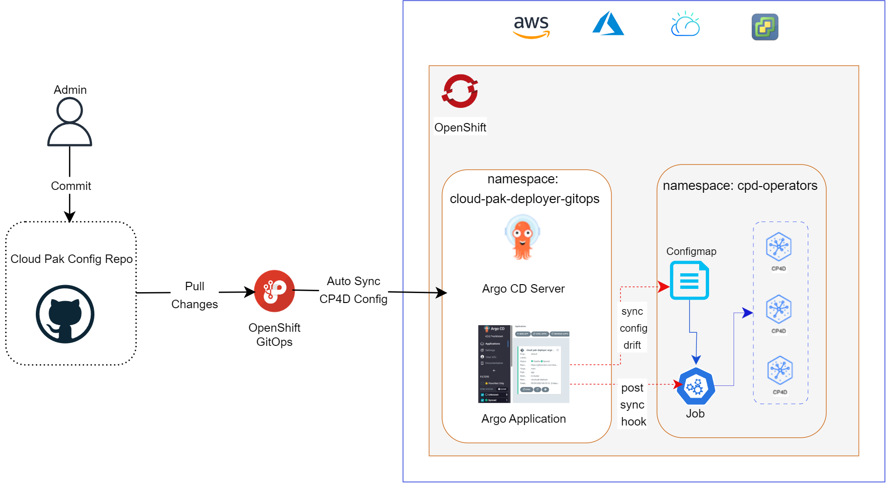
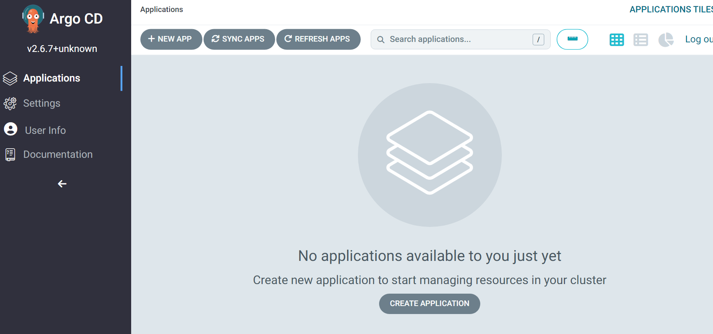
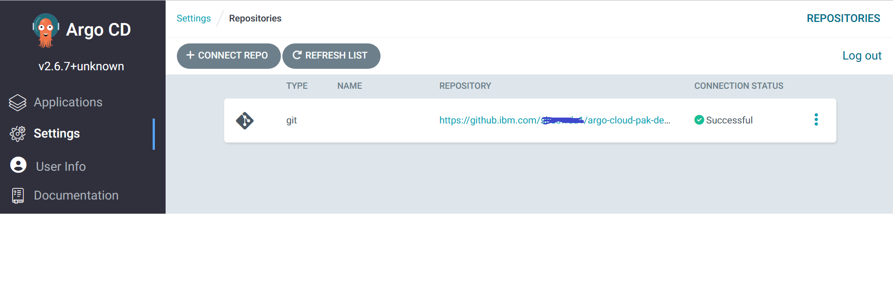
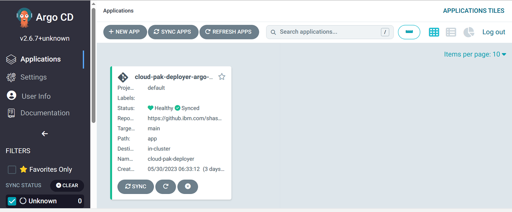
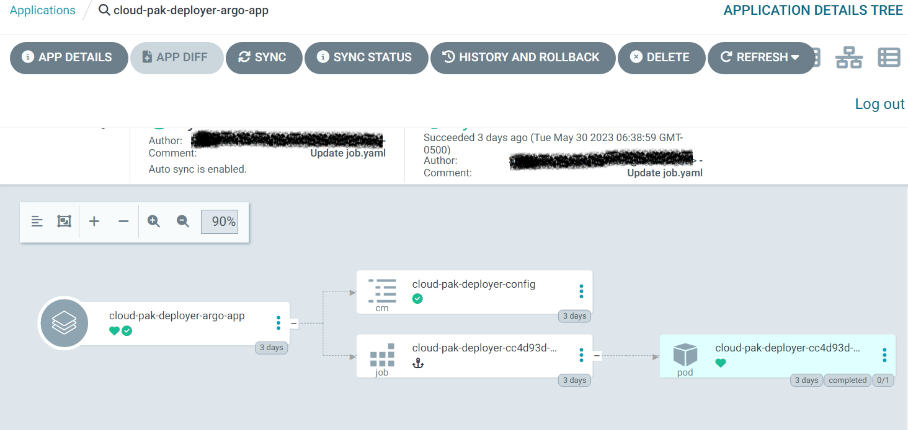
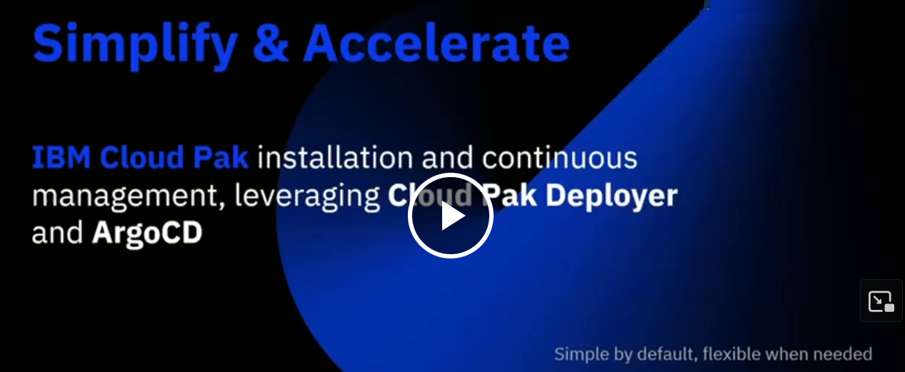

# Running deployer on OpenShift using ArgoCD
<br>
<br>
Running Cloud Pak Deployer through Argo CD is a seamless process. Given that Cloud Pak Deployer synchronizes the current state with the desired state defined in the configuration, Argo is an ideal choice for streamlining the deployment process to an advanced level. Here's the architecture of CP4D deployment using Argo CD.
<br>
<br>



## Log in to the OpenShift cluster
Log is as a cluster administrator to be able to run the deployer with the correct permissions.

## Prepare the deployer project and the storage
* Go to the OpenShift console
* Click the "+" sign at the top of the page
* Paste the follliwng block (exactly into the window)
```
---
apiVersion: v1
kind: Namespace
metadata:
  creationTimestamp: null
  name: cloud-pak-deployer-gitops
---
apiVersion: v1
kind: Namespace
metadata:
  creationTimestamp: null
  name: cloud-pak-deployer
  labels:
    argocd.argoproj.io/managed-by: cloud-pak-deployer-gitops
---
apiVersion: v1
kind: ServiceAccount
metadata:
  name: cloud-pak-deployer-sa
  namespace: cloud-pak-deployer
---
apiVersion: rbac.authorization.k8s.io/v1
kind: RoleBinding
metadata:
  name: system:openshift:scc:privileged
  namespace: cloud-pak-deployer
roleRef:
  apiGroup: rbac.authorization.k8s.io
  kind: ClusterRole
  name: system:openshift:scc:privileged
subjects:
- kind: ServiceAccount
  name: cloud-pak-deployer-sa
  namespace: cloud-pak-deployer
---
apiVersion: rbac.authorization.k8s.io/v1
kind: ClusterRoleBinding
metadata:
  name: cloud-pak-deployer-cluster-admin
roleRef:
  apiGroup: rbac.authorization.k8s.io
  kind: ClusterRole
  name: cluster-admin
subjects:
- kind: ServiceAccount
  name: cloud-pak-deployer-sa
  namespace: cloud-pak-deployer

```

## Build deployer image and push to the internal registry
Building the deployer image typically takes ~5 minutes. Only do this if the image has not been built yet.

```
cat << EOF | oc apply -f -
apiVersion: image.openshift.io/v1
kind: ImageStream
metadata:
  name: cloud-pak-deployer
spec:
  lookupPolicy:
    local: true
EOF

cat << EOF | oc create -f -
kind: Build
apiVersion: build.openshift.io/v1
metadata:
  generateName: cloud-pak-deployer-bc-
  namespace: cloud-pak-deployer
spec:
  serviceAccount: builder
  source:
    type: Git
    git:
      uri: 'https://github.com/IBM/cloud-pak-deployer'
      ref: wizard
  strategy:
    type: Docker
    dockerStrategy: {}
  output:
    to:
      kind: ImageStreamTag
      name: 'cloud-pak-deployer:latest'
  triggeredBy:
    - message: Manually triggered
EOF
```

Now, wait until the deployer image has been built.
```
oc get build -n cloud-pak-deployer -w
```

## Set the entitlement key
* Update the secret below with your Cloud Pak entitlement key. Make sure the key is indented exactly as below.
* Go to the OpenShift console
* Click the "+" sign at the top of the page
* Paste the follliwng block (exactly into the window)
```
---
apiVersion: v1
kind: Secret
metadata:
  name: cloud-pak-entitlement-key
  namespace: cloud-pak-deployer
type: Opaque
stringData:
  cp-entitlement-key: |
    YOUR_ENTITLEMENT_KEY
```

## Install 'Red Hat OpenShift GitOps' (Argo) operator from OpenShift's Operator Hub
As a cluster admin, proceed to install this operator using the default selections


## Create ArgoCD resources

* Create an Argo server instance by executing the following command:

```
cat << EOF | oc apply -f -
apiVersion: argoproj.io/v1alpha1
kind: ArgoCD
metadata:
  name: cloud-pak-deployer-gitops
  namespace: cloud-pak-deployer-gitops
spec:
  server:
    autoscale:
      enabled: false
    grpc:
      ingress:
        enabled: false
    ingress:
      enabled: false
    resources:
      limits:
        cpu: 500m
        memory: 256Mi
      requests:
        cpu: 125m
        memory: 128Mi
    route:
      enabled: true
    service:
      type: ''
  grafana:
    enabled: false
    ingress:
      enabled: false
    resources:
      limits:
        cpu: 500m
        memory: 256Mi
      requests:
        cpu: 250m
        memory: 128Mi
    route:
      enabled: false
  monitoring:
    enabled: false
  notifications:
    enabled: false
  prometheus:
    enabled: false
    ingress:
      enabled: false
    route:
      enabled: false
  initialSSHKnownHosts: {}
  sso:
    dex:
      openShiftOAuth: true
      resources:
        limits:
          cpu: 500m
          memory: 256Mi
        requests:
          cpu: 250m
          memory: 128Mi
    provider: dex
  applicationSet:
    resources:
      limits:
        cpu: '2'
        memory: 1Gi
      requests:
        cpu: 250m
        memory: 512Mi
    webhookServer:
      ingress:
        enabled: false
      route:
        enabled: false
  rbac:
    policy: |
      g, system:cluster-admins, role:admin
      g, cluster-admins, role:admin
    scopes: '[groups]'
  repo:
    resources:
      limits:
        cpu: '1'
        memory: 1Gi
      requests:
        cpu: 250m
        memory: 256Mi
  resourceExclusions: |
    - apiGroups:
      - tekton.dev
      clusters:
      - '*'
      kinds:
      - TaskRun
      - PipelineRun
  ha:
    enabled: false
    resources:
      limits:
        cpu: 500m
        memory: 256Mi
      requests:
        cpu: 250m
        memory: 128Mi
  tls:
    ca: {}
  redis:
    resources:
      limits:
        cpu: 500m
        memory: 256Mi
      requests:
        cpu: 250m
        memory: 128Mi
  controller:
    processors: {}
    resources:
      limits:
        cpu: '2'
        memory: 2Gi
      requests:
        cpu: 250m
        memory: 1Gi
    sharding: {}
EOF
```

* Install the ArgoCD CLI by following the instructions provided in this [article](https://argo-cd.readthedocs.io/en/stable/cli_installation/)
* Run the following command from the terminal to obtain the route URL of the Argo server instance:
```
    oc get routes -n cloud-pak-deployer-gitops | grep argocd-gitops-server | awk '{print $2}'
```
* Route URL could be stored in an environment variable using the following command:
```
    export ARGOCD_SERVER_URL=$(oc get routes -n cloud-pak-deployer-gitops | grep argocd-gitops-server | awk '{print $2}')
```
* Retrieve the 'admin' credentials for logging into the ArgoCD UI by executing the following command in the terminal. The command output will provide the password for the 'admin' user:
```
    oc extract secret/argocd-gitops-cluster -n cloud-pak-deployer-gitops --to=-
```
* To log in to the ArgoCD server, use the following command: 
    * execute the command below from terminal
        ```
        argocd login $ARGOCD_SERVER_URL
        ```
    * Accept the self-signed certificate by typing 'y' and then pressing Enter. Please note that in a production environment, it's advisable to use a TLS certificate from a certified authority for the ArgoCD server
    * Enter the username as 'admin'.
    * Enter the password (copy the secret value extracted following an earlier step).
* Login to ArgoCD UI
    * Go to "Networking > Routes" from OpenShift web console ('argocd' should be selected as namespace )
    * Click the route url of 'argocd-gitops-server' route.
    * Login as OpenShift User (sso is enabled)
    * Login as 'admin' - getting the password of admin user is explained in earlier steps
    * The ArgoCD UI will resemble the screenshot provided below:
    <br>



* Establish a Git configuration repository to store the anticipated state of the CP4 target instance.
  * Here's an example of the same, located in this [folder](../../../../config-repo-for-argo) 
* Run the following command to add the configuration repository to the ArgoCD server: 
```
    argocd repo add <<config git repo end point url>> --username <<token name>> --password <<token>>
```
  * Upon successful execution of the aforementioned step, the repository will be listed in the ArgoCD UI, as depicted below:
  <br>



## Create Argo application 
Replace the <b>repoURL:</b> field value with the endpoint URL of your config Git repository in the snippet provided below, and then execute it from the command line:
  ```
    cat << EOF | oc apply -f -
    apiVersion: argoproj.io/v1alpha1
    kind: Application
    metadata:
    name: cloud-pak-deployer-argo-app
    namespace: cloud-pak-deployer-gitops
    spec:
    destination:
        namespace: cloud-pak-deployer
        server: https://kubernetes.default.svc
    project: default
    source:
        path: cp4d
        repoURL: <<config repo url endpoint>>
        targetRevision: main
    syncPolicy:
        automated:
        prune: true
        selfHeal: false
        syncOptions:
        - CreateNamespace=true
    EOF
  ```
* Argo app would appear in Argo UI (as shown in the screen shot below) after successful execution of the command given in the above step

    

## Establish Sync 
Sync starts automatically, command below could executed from the terminal for manual sync
```
argocd app sync cloud-pak-deployer-gitops/cloud-pak-deployer-argo-app 
```

The deployer job gets hooked, post sync. The job start running in OpenShift's cloud-pak-deployer namespace. The status could be seen from Argo CD UI and may look like similar to below screenshot, when the job finishes its run and the actual state is synched with desired state.



Henceforth, it's simply a matter of modifying the config file to add/remove cartridges and pushing it to the repository. The Argo pipeline and the post-sync job will handle the rest. The demo below illustrates what can be achieved by following the steps mentioned above.

[](https://ibm.box.com/s/xnuxi37n51l3bb8o2uiafqaxmmle3xyg)